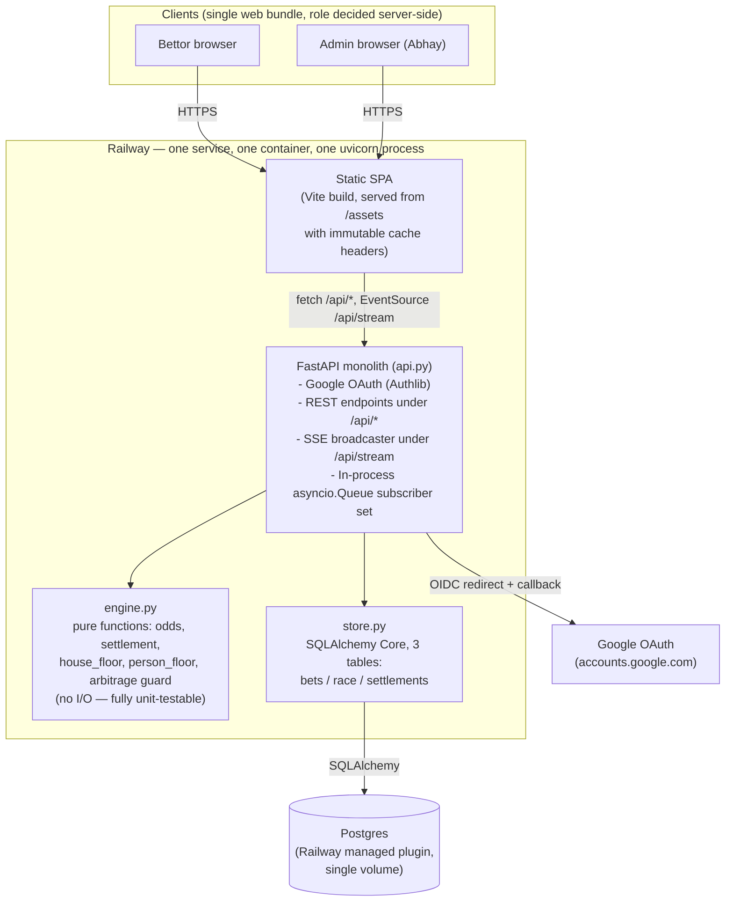
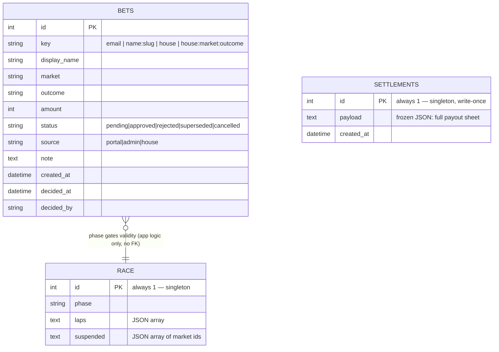
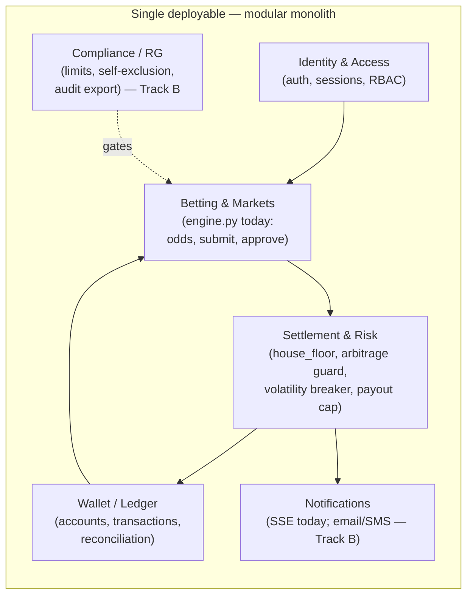
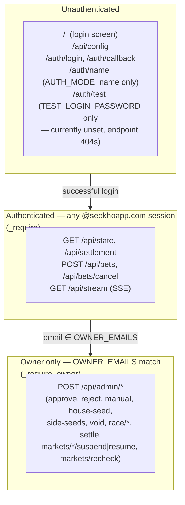
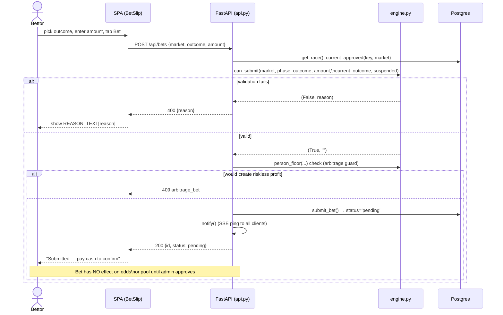
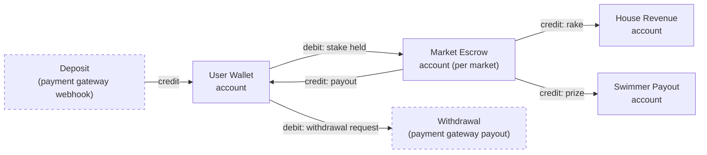
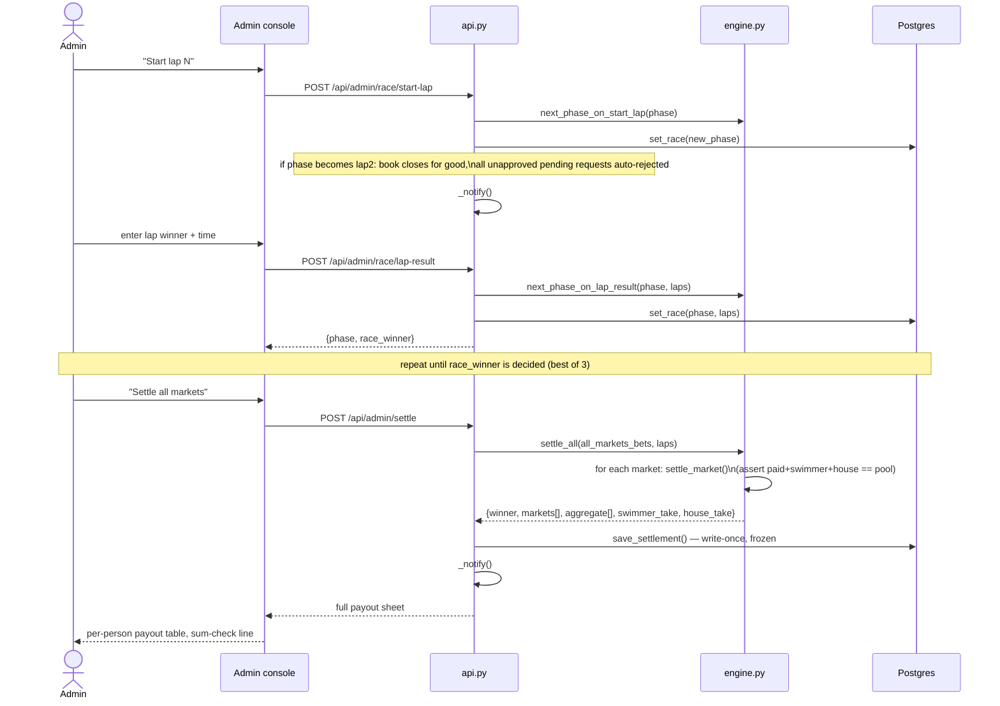
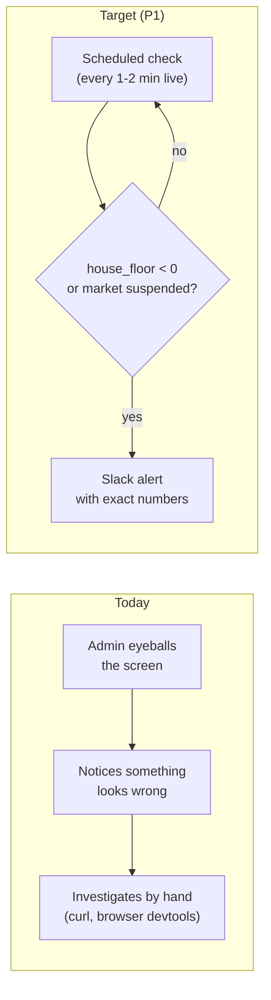

# SeekhoStake — Product Architecture Review

**Author:** Principal architect review (Claude, embedded with the team that built the system)
**Date:** 24 Sept 2026
**Scope:** `swim-bet/` — the parimutuel betting portal for the Khuseel vs Bansod swim race (27 Sept 2026)
**Status:** Current-state audit + target-state recommendation. No legal opinion is offered anywhere in this document; see [Compliance](#0-the-gate-that-comes-before-every-other-recommendation).

---

## How to read this document

Every one of today's commits was reviewed against the actual running code (`api.py`, `engine.py`, `store.py`, `frontend/src/App.jsx`, the four test files, `Dockerfile`, `requirements.txt`) as of commit `e0c73d2` (27 commits, 4,047 lines, 1,390 tests passing). Nothing here is generic best-practice padding — every "current issue" cites the actual line of reasoning or code pattern that produces it.

Two tracks run through this whole review, because they require genuinely different architectures:

- **Track A — "Private Pool" (what this is today, and what it's safe to become):** a closed-group, cash-settled, single-event coordination tool for people Abhay knows personally. The platform never custodies money — cash changes hands in person; the app computes who owes whom. This is the track worth investing in near-term.
- **Track B — "Platform" (what a licensed, multi-event, real-money product would require):** everything a "scalable, reliable betting product" implies in the prompt that started this review — wallets, KYC, multiple concurrent events, horizontal scaling, a compliance function. This track is documented in full because it was asked for, but it is **gated on legal clearance that does not currently exist** (see §0). Treat Track B sections as a target-state reference architecture, not a backlog to start executing Monday.

Every recommendation carries: **Current issue → Recommendation → Why it matters → Priority (P0–P3) → Complexity → Migration/rollback**. Priorities are scored against **Track A** (the thing actually being run) unless a recommendation is explicitly marked Track B-only.

---

## 0. The gate that comes before every other recommendation

**Current issue.** India's Promotion and Regulation of Online Gaming Act (2025) prohibits real-money online games nationally, regardless of whether the outcome is skill-based or chance-based — this is why Dream11, MPL, and comparable platforms shut down India real-money operations. Separately, the Public Gambling Act 1867 and state-specific gambling statutes have historically covered betting pools even outside a formal "operator" model, and treatment of small private wagers among friends varies by state and has not been tested against this specific product shape (a software tool that computes settlement for a cash pool among colleagues at a single company). Nothing about running the compute layer on a company laptop, keeping the operator's own margin at zero personal profit, or restricting it to one company's employees is a substitute for legal review.

**Recommendation.** Before any decision to (a) run this again for a second event, (b) open it beyond a small closed circle, or (c) introduce real digital money movement (wallets, UPI, cards) — get a qualified lawyer to review the specific fact pattern: closed employee group, single company, cash settled in person, no operator profit margin taken by policy (the "house" cut funds the swimmer, not Abhay), frequency of recurrence. This review cannot and does not clear that path; it only flags that the question exists and blocks Track B entirely until answered.

**Why it matters.** Every hour spent building KYC, deposit/withdrawal rails, or a licensing-grade audit trail (Track B) is wasted if the underlying activity isn't legally permitted to exist as a repeatable product in this jurisdiction. This is the single highest-leverage finding in the entire review — it dominates every P0 below it.

**Priority.** P0 — blocks Track B in its entirety. Does not block Track A hardening (a one-off/occasional private pool with in-person cash settlement is a materially different risk profile, but "materially different" is not "cleared" — see the Risk Register).

**Complexity.** N/A — this is a legal engagement, not an engineering task.

**Migration/rollback.** N/A.

---

## 1. Current-state architecture

### 1.1 System diagram



### 1.2 What this actually is, precisely

| Layer | Reality today |
|---|---|
| **Compute** | One Railway service, one Docker container, one `uvicorn` process (no `--workers` flag in the `CMD`). |
| **State** | One Postgres database, three tables (`bets`, `race`, `settlements`), all singleton-scoped to **one race** (`race.id` and `settlements.id` are hardcoded to `1` everywhere in `store.py`). |
| **Identity** | Google OAuth email as the bettor's primary key. No `users` table — identity is "whatever key appears on a `bets` row." |
| **Money** | **There is no wallet.** Every rupee is physical cash that changes hands between a bettor and Abhay in person. The database does not represent money — it represents *intent and settlement math* over money that lives outside the system entirely. |
| **Real-time** | Server-Sent Events (`/api/stream`), one in-process `asyncio.Queue` per connected browser tab, held in a module-level Python `set()`. Broadcasting a "something changed" ping (not a payload) triggers each client to re-fetch `/api/state`. |
| **Frontend** | One React SPA (Vite build), one 951-line component file, `fetch`-based polling client with a 15s fallback poll behind the SSE stream. No component-level tests. |
| **Deploy** | `git push` → Railway auto-builds the committed `Dockerfile` → replaces the running container. No staging environment. No CI gate. No feature flags. |
| **Test coverage** | 1,390 tests, overwhelmingly concentrated in `engine.py` (pure settlement/odds math, deterministic + property-fuzzed) and one FastAPI `TestClient` end-to-end suite. Zero frontend tests. Zero load tests. |

### 1.3 The domain model as it actually exists



This is worth sitting with, because it is the most important current-state fact in the document: **there is no `users` table, no `wallets` table, no `ledger` table, no `events`/`races` table with real identity, and no foreign keys at all.** `bets.key` is a free-text string that happens to be an email for OAuth users, a slugified name for admin-entered rows, and a literal string `"house"` or `"house:<market>:<outcome>"` for the organiser's own positions — three different identity schemes coexisting in one column, disambiguated only by string-prefix convention (`.startswith("house")`) checked at every read site across `api.py`. It works, and it is fully covered by tests — but it is a **status-flag ledger**, not a ledger: money movement is represented as a mutable `status` column transition (`pending → approved → superseded`), not as an append-only sequence of balanced entries.

---

## 2. Financial architecture

### 2.1 Current issue: no double-entry ledger, no immutable transaction log

**Current issue.** "Settlement" is: run `engine.settle_all()` once over the current `bets` rows, get back a JSON blob, freeze it into `settlements.payload`. There is no notion of an *account* with a *balance* derived from a *sequence of transactions*. If you wanted to answer "how much cash has physically been collected from real bettors as of this exact moment," you'd re-derive it by summing `bets.amount` for `status='approved'` and `key NOT LIKE 'house%'` — a query, not a stored fact, and one that has to be re-written correctly at every call site (it currently *is*, correctly, in `api_state`'s house payload — but there is nothing structurally preventing the next feature from getting it wrong).

**Why this has been safe so far.** The settlement math (`engine.settle_market`, `settle_all`) is exceptionally well-guarded: every market's payout is asserted to sum exactly to its pool (`assert paid + swimmer + house == pool`), and this is fuzz-tested (`test_house_floor_fuzz.py`) across ~2,000 randomized and adversarial books. That is a real, working substitute for double-entry bookkeeping *at settlement time*. What it does **not** give you is an audit trail of every state transition leading up to that point, replayable independent of the current `bets` table contents, or resilient to a bug in a *future* feature that mutates a row instead of appending one.

**Recommendation.**
- **Track A (do this even for the private pool):** add an append-only `ledger_entries` table populated at every money-moving event (bet approved, bet voided, market settled) — even though the "money" is cash and the ledger is purely a record, not a control. Each entry: `{id, ts, actor, bet_id, kind (stake_held|stake_released|payout|rake|swimmer_cut), amount, running_context}`. Never update a row; corrections are new offsetting entries. This turns "prove what happened" from "reconstruct it from `bets.status`" into "read the log."
- **Track B (real wallets):** proper double-entry — every transaction posts to at least two accounts (e.g., debit `user_wallet:123`, credit `house_liability:market_lap1`) and the invariant "sum of all account balances == 0" is checked continuously, not just at one settlement instant. Accounts: user wallets, house rake/revenue, swimmer payout, promotional-credit liability, pending-stake escrow.

**Why it matters.** The current design is provably correct for the shape of bug the fuzz suite tests for (bad settlement math). It has no defense against a *different* shape of bug: a support-tool script, a manual DB fix, or a future feature that does an `UPDATE bets SET amount = ...` instead of writing a new row. An immutable ledger makes that class of error structurally visible (the ledger and the mutable table would disagree) instead of silently possible.

**Priority.** P1 for Track A (valuable now, not urgent for a single race with 19 bettors and one settlement). P0 for Track B (non-negotiable before real money custody).

**Complexity.** Medium (Track A: one new table + write calls at 4-5 existing mutation points, no schema change to existing tables, additive-only). Large (Track B: full ledger engine, reconciliation jobs, account model).

**Migration/rollback.** Purely additive table — zero risk to existing behavior; can be added and backfilled from the existing `bets` history without touching current code paths, then wired into new mutations behind a flag. Rollback is "stop writing to it," since nothing reads from it yet.

### 2.2 Idempotency, atomicity, rounding

| Concern | Current state | Assessment |
|---|---|---|
| **Rounding** | Every payout uses integer floor division (`(stake * pot) // total`), remainder falls to the house — asserted to sum exactly at every market. | **Correct and well-tested.** This is the one piece of "financial architecture" that is already at Track-B quality. |
| **Atomicity** | Each mutation is one SQLAlchemy `engine.begin()` transaction. `approve_bet` does supersede-then-approve inside one transaction. | Good for single-statement-group atomicity. Not race-safe under concurrency — see §6.1. |
| **Idempotency keys** | **None.** `POST /api/bets` has no client-supplied idempotency key; a double-tap or a retried request creates two separate pending rows (mitigated only by the UI disabling the button after submit, not by the server). | Gap — see §5. |
| **Reconciliation** | Manual: the admin console shows "cash to collect" per pending item; there is no scheduled job that asserts `sum(approved human stakes) == expected cash on hand`. | Gap for Track A; mandatory automated job for Track B. |

**Recommendation.** Add a client-generated UUID `idempotency_key` on `POST /api/bets`, unique-indexed server-side; a retried submit with the same key returns the original result instead of creating a duplicate. Small, additive, no migration risk.

**Priority.** P1. **Complexity.** Small. **Migration/rollback.** Additive column + unique index; old clients (none exist) would just not send the header and get today's behavior.

---

## 3. Event-driven design

### 3.1 What exists today

The system already has one real event bus: the SSE broadcaster. It is minimal by design (a "ping," not a payload) and that turns out to be the right call for this scale — it sidesteps the entire "what if the client missed an event / how do I replay" problem class by making every event equivalent to "go re-fetch the truth." That is a legitimate, deliberately simple pattern (sometimes called "invalidate-and-refetch") and should not be over-engineered away for a 30-person single event.

**Current issue.** The subscriber set is an in-process Python `set()` of `asyncio.Queue` objects. This has three concrete consequences, all correctly called out in the code's own comments:
1. It only works with exactly one `uvicorn` worker/process. (Correctly documented in `api.py`'s comment on `_subscribers`.)
2. A container restart (every deploy) silently drops all connections; clients reconnect via `EventSource`'s native retry, but there is a window (observed and fixed today in commit `e0c73d2`, "stale odds after reject") where a client can miss a ping and show stale state until the fallback 15s poll or a tab-focus event catches up.
3. There is no dead-letter or retry concept, because there is no payload to retry — the worst case of a dropped ping is "state is stale until the next of: next ping, 15s fallback poll, or tab refocus." This is an acceptable failure mode for odds display; it would **not** be acceptable if this channel ever carried anything authoritative (it doesn't — it's purely a "go check" nudge).

**Recommendation.**
- **Track A:** keep this exact design. It is well-suited to the scale and already has the tested fallback-poll safety net. Do not introduce Kafka/Redis pub-sub for 30 concurrent users — that would be solving a problem this system does not have.
- **Track B (multi-instance horizontal scaling):** the in-process `set()` breaks the moment there is more than one app instance behind a load balancer (an approval on instance A never notifies a bettor's SSE connection open on instance B). At that point, replace the in-process queue with a shared pub/sub (Postgres `LISTEN/NOTIFY` is enough at moderate scale and avoids adding a new infrastructure dependency; Redis pub/sub or a managed queue if instance count or event volume grows further).

**Why it matters.** Getting this wrong in either direction is costly: over-building it now (a message queue for 30 users) is wasted complexity; under-building it at Track-B scale (still in-process) means odds updates silently stop propagating to a subset of users the moment you add a second instance, with no error, just staleness — a business-critical bug for a betting product (stale odds = wrong price shown = fairness dispute).

**Priority.** P3 today (works, tested, matches scale). P0 the moment Track B introduces a second app instance — this is a hard architectural fence, not a "nice to have," so it belongs in this document even though it's not actionable yet.

**Complexity.** Medium to swap to `LISTEN/NOTIFY` (Postgres-native, no new infra) when the time comes.

**Migration/rollback.** Fully swappable behind the same `_notify()` call site — every mutating endpoint already funnels through one function; changing its implementation doesn't touch any of the ~15 call sites.

### 3.2 Ordering, replay, consumer idempotency

Not applicable in the traditional sense today — there is one producer (the API process itself) and the "event" carries no ordering-sensitive payload. This section becomes relevant only under Track B with genuinely external event sources (a results feed, a payment webhook). Recommendation for that future: every external event handler must be idempotent by the event's own ID (store `processed_event_ids`, reject replays), and a dead-letter table for anything that fails processing after N retries, reviewed manually. Not scored with a priority here because there is no external event source today to apply it to.

---

## 4. Service boundaries

**Current issue.** None, in the sense that a single FastAPI file is exactly the right shape for the current scale, team size (effectively one operator), and traffic (dozens of requests around a handful of live windows). There is no over-engineering to walk back.

**Recommendation.** Do **not** move to microservices at this stage — there is no organizational, deployment-cadence, or scaling pressure that would justify the operational tax (multiple deploys, network calls replacing function calls, distributed tracing, service discovery) for a product with one operator and no plans for independent team ownership of sub-domains. The right target for Track B is a **modular monolith**: the same single deployable, but with explicit internal module boundaries so that the high-risk domains are separated by interface, not by network:



Concretely: split `api.py` (currently 790 lines holding auth, every route, and the SSE broadcaster together) into `auth.py`, `routes_betting.py`, `routes_admin.py`, `stream.py`, importing from `engine.py` and a new `ledger.py` — same process, same deploy, same database, just enforced module boundaries so that (for example) nothing outside `ledger.py` can construct a ledger entry directly.

**Why it matters.** This is the cheapest possible insurance against the two realistic futures: (a) the product stays exactly this size, in which case the refactor cost was small and the code is more readable; (b) the product grows and specific domains (wallet, compliance) need independent review, testing rigor, or eventually extraction — module boundaries make that extraction a file move, not an archaeology project.

**Priority.** P2 — valuable, not urgent; do it opportunistically alongside the ledger work in §2, since both touch the same area.

**Complexity.** Medium (mechanical file-split + import fixes, no behavior change, fully covered by the existing 1,390 tests which would need only import-path updates).

**Migration/rollback.** Zero data migration. Behaviorally invisible. Rollback is `git revert` on a refactor-only commit.

---

## 5. API architecture

| Concern | Current state | Recommendation | Priority |
|---|---|---|---|
| **Versioning** | None — routes are `/api/...` with no version segment. | Fine for a single-consumer (own SPA) API today. If a public API is ever exposed (Track B), introduce `/api/v1/...` **before** the first external consumer, not after. | P3 |
| **Schema/validation** | Pydantic models on every `POST` body (`BetIn`, `LapResult`, etc.) — genuinely good, consistent, already in place. | Keep the pattern. | — |
| **Error conventions** | `HTTPException(status, "reason_code")` with a frontend `REASON_TEXT` lookup — a real, if informal, error-code contract. Reasonably consistent (`book_closed`, `arbitrage_bet`, `market_suspended`, etc.). | Formalize into a documented enum + OpenAPI `examples` so the contract is discoverable without reading `App.jsx`. | P3 |
| **Pagination** | None anywhere — every list endpoint (`/api/admin/pending`, the book, the aggregate payout sheet) returns the full set. | Correct decision at 19-30 bettors. Would need pagination only if bettor count reaches the thousands (Track B). | — |
| **AuthN** | Google OAuth (session cookie) or name-mode fallback; every route calls `_require`/`_require_owner`. | Solid for this scale. | — |
| **AuthZ** | Binary: owner or not (`OWNER_EMAILS` env var, currently one address). No role granularity (support vs risk vs finance). | See §12 (RBAC) — needed the moment more than one human needs admin-shaped access with different permissions. | P2 (Track B: P0) |
| **Rate limiting** | **None.** `POST /api/bets` and every other mutating endpoint can be called at unlimited frequency by an authenticated session. | Add a simple per-user token-bucket (e.g. 1 request/second sustained, burst 5) on mutating endpoints. At this scale it's an abuse/fat-finger guard, not a capacity concern. | P1 |
| **Idempotency keys** | None (see §2.2). | Add to `POST /api/bets` at minimum. | P1 |
| **API docs** | FastAPI's auto-generated OpenAPI/Swagger (`/docs`) exists implicitly (FastAPI always serves it) but is **currently reachable at the same origin as production with no additional gate** — anyone can browse `/docs` and see the full route/schema surface (not a secrets leak, but reconnaissance for an attacker is currently free). | Restrict `/docs` and `/openapi.json` to owner-authenticated requests in production, or disable them (`docs_url=None`) and keep a hand-maintained doc instead. | P2 |
| **Backward compatibility** | N/A — one client, deployed atomically with the API. | Becomes relevant only with an external API consumer (Track B). | — |

---

## 6. Data architecture

### 6.1 Current issue: no DB-enforced invariants for the "one live bet per person per market" rule

**Current issue.** The rule "at most one `status='approved'` row per `(key, market)`" is the single most load-bearing invariant in the whole betting engine — the entire odds/settlement model assumes it. It is enforced **only** in application code (`approve_bet`'s supersede-then-approve inside one transaction), with no database constraint backing it up. Two concurrent `approve` calls for the same person+market (e.g., a double-click, or — if `OWNER_EMAILS` ever grows past one admin — two admins approving different pending requests for the same bettor at the same instant) can race between "supersede the old approved row" and "insert the new approved row," because neither statement takes an explicit row lock (no `SELECT ... FOR UPDATE`) on the (key, market) pair before the two-step update.

**Recommendation.** Add a Postgres **partial unique index**: `CREATE UNIQUE INDEX one_approved_per_person_market ON bets (key, market) WHERE status = 'approved'`. This makes the invariant true by construction — a racing second `INSERT`/`UPDATE` that would create a second approved row for the same key+market fails at the database, not silently succeeds. Pair it with a `SELECT ... FOR UPDATE` on the existing approved row (if any) inside `approve_bet`'s transaction to turn the DB error into a clean retry/reject instead of a 500.

**Why it matters.** This is the difference between "the invariant has held in every test and every real run so far" and "the invariant cannot be violated." For a financial settlement system, that distinction is the entire point of a data architecture review — single-admin manual approval today makes the race window narrow, but narrow is not zero, and the current single-admin constraint is itself a scaling limit (§12) that this exact fix removes safely.

**Priority.** P1 (cheap, high-value, directly enables safely adding a second admin later).

**Complexity.** Small — one migration (`CREATE UNIQUE INDEX`), one `try/except IntegrityError` in `approve_bet`.

**Migration/rollback.** Additive index; if it ever needs to be removed, `DROP INDEX` is instant and non-destructive. Before adding it, run a one-time query to confirm no existing violation (there won't be one, given single-admin history, but verify rather than assume).

### 6.2 Other data-architecture findings

| Concern | Current state | Recommendation | Priority |
|---|---|---|---|
| **Multi-event support** | `race.id` and `settlements.id` are hardcoded to `1` throughout `store.py`. The schema physically cannot hold a second race without a migration. | Introduce an `events` table and thread `event_id` through `bets`/`race`/`settlements` before running a second event. This is the literal difference between "a tool for this race" and "a platform." | P1 (before event #2 exists), P0 for Track B |
| **PII classification** | Only PII held is name + Google email, both necessary and minimal. No phone, no payment details, no address. | Good minimalism — don't add fields you don't need even when convenient. Document this data map once (one paragraph) so it's an explicit decision, not an accident. | P3 |
| **Encryption at rest** | Railway-managed Postgres; encryption-at-rest depends on Railway's infrastructure defaults, not app-level control. | Verify (not assume) Railway's current at-rest encryption posture for the plan tier in use; document the finding. | P2 |
| **Backups** | **Unverified as of this review** — Railway's Postgres plugin does not guarantee automatic backups on every plan tier; this was not explicitly configured during today's rapid setup. | Confirm backup/point-in-time-recovery status in the Railway dashboard and either enable it or add a scheduled `pg_dump` to external storage. See Risk Register R-2 and the Ops Runbook. | **P0** |
| **Retention policy** | None defined — data persists indefinitely by default. | For Track A (closed friend pool), define a simple retention statement (e.g., "settlement records kept for N months for dispute resolution, then anonymized") and put it in the Rules page bettors already read. | P2 |
| **Migrations** | Ad hoc `ALTER TABLE ... ADD COLUMN IF NOT EXISTS` blocks run at app startup (`store.init()`), no migration framework, no version tracking of which migrations have run beyond "does the column exist." Applied 3 times today already (market/outcome columns, suspended column) and worked correctly, but there's no history of *what* changed *when*. | Adopt Alembic (or even a simple numbered-migrations-table pattern) before the schema grows further. The current approach works but leaves no record for a future engineer (or future Claude session) to reconstruct schema history from anything but `git log`. | P2 |

---

## 7. Frontend architecture

**Current issue.** `App.jsx` is a single 951-line file holding every component (`Login`, `RaceStrip`, `OddsBoard`, `MarketCard`, `BetSlip`, `MyBets`, `BookTable`, `Settlement`, `Admin`, `Rules`, the root `App`). State management is entirely `useState`/`useCallback` at the component level with one full-state `refresh()` re-fetch pattern; there is no client-side state library (Redux/Zustand/Context) because the app doesn't need one yet — a single `/api/state` payload IS the entire client state, refetched wholesale on every SSE ping. This is a legitimate, deliberately simple choice for this scale, not an oversight.

**What's already good and should not be "fixed":**
- The anti-churn guard (skip `setState` when the fetched JSON is byte-identical to the last one) is exactly the right fix for the real problem it solved today (a re-render mid-tap shifting a button under the admin's finger) — cheap, correct, no library needed.
- Optimistic UX is intentionally *not* used for bet submission (the bet stays "pending" until cash is physically confirmed) — this is correct for a cash-first product; a naive "optimistic update" here would show a bettor as holding a position before their cash has actually been collected, which is a worse bug than a moment of latency.

**Recommendation.**
- **Track A, low urgency:** split `App.jsx` into one file per component (`components/OddsBoard.jsx`, etc.) purely for maintainability — 951 lines in one file is past the point where it helps anyone, including future editors of this exact codebase (this session alone struggled with concurrent edits landing in the same file from two directions).
- **Frontend tests:** currently zero. Add component tests (React Testing Library) for the two highest-consequence components: `BetSlip` (money in) and `Admin`'s approve flow (money confirmed) — these are the two places a UI bug has direct financial consequence.
- **Accessibility:** not evaluated in today's build (no explicit ARIA review, though semantic HTML — real `<button>`, `<input>` — is used throughout, which gets a baseline of accessibility for free). A pass with an automated checker (axe) plus keyboard-only navigation testing is worthwhile before any wider rollout.
- **Offline/reconnection:** SSE reconnection is handled natively by `EventSource` plus the 15s fallback poll and the tab-focus catch-up added today — reasonable coverage already. Not tested for the case of a bettor placing a bet while genuinely offline (no network) — the fetch will simply fail; confirm the UI surfaces a clear "you're offline, retry" state rather than a generic error.

**Priority.** P2 (component split, frontend tests), P3 (accessibility audit, offline UX polish).

**Complexity.** Medium (component split is mechanical but touches every line); Small (accessibility pass); Medium (test setup from zero).

**Migration/rollback.** Component split is a pure refactor — behaviorally invisible, revertible via `git revert`.

---

## 8. Authentication & authorization boundaries



**Current issue.** Authorization is a single boolean (`_is_owner`) gated by one environment variable holding a comma-list of emails, defaulting to exactly one address. There are no intermediate roles — "can view the admin ledger but not approve bets," "can record lap results but not touch money," "can view reconciliation but not place bets" all collapse into the same all-or-nothing `_require_owner` check. This is a correct minimal design for **one operator**, and actively wrong the moment a second human needs *any* admin-shaped capability with narrower scope (see §12, RBAC, Track B).

**Recommendation.** Track A: no change needed while there is exactly one operator. Track B: introduce a proper role table (`role ∈ {bettor, support, trading_risk, compliance, finance, admin}`) with per-route permission checks replacing the single `_require_owner`. Design the route-permission mapping *before* the second admin is added, not reactively after an incident.

**Why it matters.** The moment "operations" or "support" needs read-only access to help a bettor with a dispute, the current binary model forces a choice between giving them full financial control (bad) or building nothing (support can't help). This is a common and avoidable failure mode.

**Priority.** P3 today (single operator, correctly matched). P0 the day a second human needs any admin capability.

**Complexity.** Medium — the permission-check pattern is already centralized (`_require`/`_require_owner` as the only two gates), so extending it to a role enum is a contained change, not a rewrite.

**Migration/rollback.** Additive (`role` column defaulting to today's binary mapping); fully backward compatible.

---

## 9. Bet placement flow (current, as built and tested today)



Note what this diagram makes visible: **the bettor's own submit does not move money or lock odds** — it is a request. Cash confirmation (the next diagram) is the actual state transition. This is the correct shape for a cash-first product and should be preserved even if Track B ever adds instant digital payment (at which point "submit" and "confirm cash" would collapse into one step, but the state machine — pending → approved — should stay, now representing payment-gateway confirmation instead of a human nod).

---

## 10. Wallet / ledger flow

### 10.1 Current (cash reconciliation, not a ledger)

```mermaid
sequenceDiagram
    actor Admin
    participant UI as Admin console
    participant API as api.py
    participant DB as Postgres

    Note over Admin: Bettor hands over physical cash
    Admin->>UI: tap "Approve" on pending request
    UI->>API: POST /api/admin/bets/{id}/approve
    API->>DB: supersede old approved row (if any) in same market
    API->>DB: mark this row status='approved'
    API->>API: compute odds swing; check house_floor
    alt swing safe
        API->>API: stays open, quiet note
    else swing risky
        API->>DB: suspend_market()
        API-->>UI: 200 {suspended_market, swing}
    end
    API->>API: _notify()
    Note over DB: "Ledger" = sum(approved human stakes)\nre-derived on every read, not stored as a fact
```

### 10.2 Target (Track B — real double-entry ledger)



Every arrow above is one immutable ledger entry, in Track B. The invariant that must hold at all times (not just at settlement): sum of all account balances derived purely from summing ledger entries equals the actual custodied funds. This is the reconciliation job that would run continuously (or on a tight schedule) against the real payment processor's balance.

**Priority for §10.2 as a whole:** P0 for Track B, N/A for Track A (no real wallet exists or is recommended while cash settlement continues).

---

## 11. Race-result-to-settlement flow



**Assessment.** This flow is the strongest part of the entire system. `settle_all` is pure, deterministic, exhaustively tested (including a fuzz suite specifically constructed to try to make the house lose money, and a separate arbitrage-detection suite that enumerates every possible race outcome via `race_scripts()` and checks no bettor or the house can end up guaranteed-profitable/guaranteed-negative where that shouldn't be possible). `settlements` is genuinely immutable (`save_settlement` refuses to overwrite an existing row). This is Track-B-quality engineering already; the gaps in this document are almost entirely in the surrounding product (identity, roles, ops, ledger-as-audit-trail), not in this core settlement path.

---

## 12. Roles the current system does not yet have (Track B)

The prompt asks specifically about bettor / admin / operations / support / trading-risk / compliance / finance. Today, **one person (Abhay) is all six non-bettor roles simultaneously.** That is appropriate for a 19-30 person single event and would become a liability at any larger or more frequent scale. Target definitions for when that day comes:

| Role | Responsibility (Track B) | Today |
|---|---|---|
| **Bettor** | Places bets, views own history, requests support. | Fully implemented. |
| **Admin/Organiser** | Owns the event: seeds the book, runs the race console, settles. | Fully implemented (as the `owner` role). |
| **Operations** | Day-to-day running: approving cash, monitoring suspended markets, no settlement authority. | Not separated from Admin — see §8. |
| **Support** | Read-only access to a bettor's history to resolve disputes; no money-moving capability. | Does not exist as a role; disputes are handled ad hoc, in person. |
| **Trading / Risk** | Sets seed liquidity, tunes `VOLATILITY_SUSPEND_RATIO`/`MAX_PAYOUT_MULT`, monitors `house_floor` continuously, decides when to resume a suspended market. | Fully implemented **as code and as Abhay's judgment**, not as a distinct role with its own audit trail. Today's incident (odds swinging 40x on a thin market) was resolved by exactly this function — it's real and it works, it's just not organizationally separated from "admin." |
| **Compliance** | KYC/AML, self-exclusion, deposit/stake/loss limits, jurisdiction gating, audit export for a regulator. | Does not exist. Blocked on §0 regardless. |
| **Finance** | Reconciliation, tax/reporting, ledger review independent of the person who can approve bets (segregation of duties). | Does not exist — Abhay is simultaneously the person taking cash, approving bets, and holding admin credentials, with no independent check. See Risk Register R-6. |

**Priority.** P2 to formally define these roles in code (RBAC) even before there are multiple humans to assign them to, because the *code path* for "who can do what" should exist before the *organizational* need does — retrofitting RBAC under pressure (right when a second admin is urgently needed) is worse than building it early and having one person hold every role for now.

---

## 13. Scalability & reliability

| Concern | Current state | Assessment / Recommendation | Priority |
|---|---|---|---|
| **Race-start traffic spike** | ~19-30 users polling `/api/state` every 15s plus SSE; single process, single DB connection pool (`pool_pre_ping=True`, default pool size). | Comfortably within capacity for this scale — no action needed for Track A. Load-test before assuming this holds at 10x the user count. | P3 |
| **Concurrent bet placement** | No explicit concurrency control beyond the transaction per request; SQLAlchemy's connection pool serializes at the DB level. | Fine at current volume. The real concurrency risk is the approval race in §6.1, not placement volume. | — |
| **Settlement burst** | Settlement is a single request computing all markets at once (`settle_all`), O(markets × race_scripts × bettors) — trivially fast at 7 markets / 6 scripts / dozens of bettors. | No action needed until market or bettor count is orders of magnitude larger. | — |
| **Horizontal scaling** | Cannot run more than one instance today without breaking the in-process SSE broadcaster (§3.1) and without a DB-level lock for the approval race (§6.1). | Both fixes are documented above and are prerequisites, not just improvements, for adding a second instance. | P0 *if* horizontal scaling is ever attempted; N/A otherwise |
| **Graceful degradation** | If the DB is unreachable, every request 500s — no cached read-only fallback. | Acceptable for Track A (a single event, actively monitored by the admin in person). Track B would want a read-only "odds board" cache that degrades gracefully instead of hard-failing. | P3 (Track A), P1 (Track B) |
| **Timeouts / retries / circuit breakers (infra sense)** | No explicit HTTP client timeouts configured beyond library defaults; no retry logic on DB calls. | Add explicit timeouts on the OAuth token exchange call (the one external HTTP call in the system) — a hung Google endpoint should not hang the login flow indefinitely. | P2 |
| **Health checks** | None — no `/healthz` endpoint. Railway's own platform-level health checking is whatever it defaults to for an HTTP service. | Add a trivial `/healthz` that checks DB connectivity, for both Railway's own restart logic and future external monitoring. | P1 |
| **Disaster recovery** | Unverified backup status (§6.2, R-2). No documented restore procedure. No tested restore. | See Ops Runbook §"Disaster Recovery." | **P0** |
| **Deployment rollback** | `git revert` + push, relying on Railway's auto-deploy. Exercised successfully multiple times today (real evidence, not theoretical). | Document the exact procedure (done — see Ops Runbook) since it's already proven to work under real time pressure. | — |

---

## 14. Observability

**Current issue.** The only observability today is: Railway's raw application logs (stdout, whatever `uvicorn`'s default access log format produces), and the admin-visible `house.floor` number computed on demand. There is no structured logging, no metrics endpoint, no dashboard, no alerting, and no SLO. Every incident today (including the live odds-sensitivity incident resolved during this same session) was detected by **a human looking at the screen and being surprised**, not by any automated signal.

**Status update (same day, fourth pass): the Slack half of the P1 below is now fully live, including the process-death case.** `_alert_slack()` posts to `SLACK_WEBHOOK_URL` for market auto-suspend, unhandled exceptions, and stuck-suspended markets; a separate Railway project webhook (dashboard-configured, not in source) posts `Deployment Crashed`/`Oom Killed` events to the same channel from Railway's platform layer, covering the one case in-process alerting structurally cannot — the process dying outright. See [`risk-register.md`](./risk-register.md) and [`operations-runbook.md`](./operations-runbook.md#4-monitoring--health-checks) for full current wiring. Structured per-request JSON logging (the other half of P1) is still open. Left the original analysis below as written — it's still the reasoning that led to the fix, not superseded by it.

**Recommendation.**
- **P1 — minimal viable observability for Track A:** structured JSON logs (one line per request: route, user key, outcome, latency) instead of default access logs; a scheduled reconciliation check (every few minutes during a live event) that computes `house_floor` and posts to a Slack webhook if it ever goes negative or a market is auto-suspended — this turns today's "Abhay noticed the odds looked weird" into "a bot pages Abhay the instant `house_floor < 0` or a market suspends," which is strictly better and cheap to build given a Slack webhook is already standard tooling for this team.
- **P2 — basic metrics:** request count/latency/error-rate per route (even a simple in-memory counter exposed at `/metrics` in Prometheus text format is enough at this scale — no need for a hosted APM).
- **P3 — full SLO/dashboard tooling:** only worth it at Track B scale.

**Why it matters.** A betting product's most expensive failures are silent ones — an odds bug that pays out wrong, a settlement that doesn't balance, a market stuck suspended during a live race window with nobody watching. The existing engineering (house_floor, sum-to-pool assertions) is excellent at *preventing* bad states; observability is what tells a human *when prevention isn't enough and attention is needed right now*, and that layer is currently entirely manual.

**Priority.** P1 (alerting on `house_floor` / suspensions — cheap, high-value, directly related to today's incident). P2 (metrics). P3 (full dashboards).

**Complexity.** Small (P1 — a scheduled task + a webhook call, patterns already used elsewhere in this workspace). Medium (P2).

**Migration/rollback.** Purely additive; no risk to existing behavior.



---

## 15. DevOps

| Concern | Current state | Recommendation | Priority |
|---|---|---|---|
| **Environment separation** | None — one Railway service, one environment (`production`), no staging. Every change today was tested locally (SQLite, `SWIMBET_DEV=1`) then pushed straight to the live production database. | Add a second Railway environment (staging, separate Postgres) that mirrors production; require a smoke test there before promoting to prod. This is the single highest-leverage DevOps change available. | **P0** |
| **Infrastructure as Code** | None — Railway project/service/env-vars configured by hand through the CLI/dashboard, undocumented anywhere except this session's chat history. | Capture the Railway configuration (service settings, env var names — not values) in a checked-in `infra/README.md` or a `railway.json` / Terraform Railway provider if the team grows. | P2 |
| **CI/CD** | None — no test run gates a deploy; `git push` to `main` deploys directly. The 1,390-test suite exists but is not wired to run automatically before deploy. | Add a GitHub Actions workflow: run `pytest` + frontend build on every push; only allow Railway auto-deploy from a branch that passed CI (or add a manual "tests passed" gate). | **P0** — the test suite already exists and is good; not running it automatically before every deploy is leaving the existing investment on the table. |
| **Feature flags** | None — every change ships to 100% of traffic immediately. Demonstrated concretely today: the volatility circuit breaker, the payout cap, and the house-floor gate were all designed, tested, and deployed straight to a **live, in-progress betting event** within minutes, with no ability to stage the rollout. | For Track A this is a known, accepted trade-off given the single-operator/single-event context and the strength of the test suite as a substitute gate. For Track B, introduce even a simple env-var-based flag system before shipping risk-sensitive logic changes during a live window. | P2 |
| **Migrations as a release step** | Ad hoc `ALTER TABLE IF NOT EXISTS` at app boot (§6.2) doubles as an implicit, un-versioned migration step. | Covered in §6.2 (Alembic). | P2 |
| **Staged rollouts / canary** | None — not meaningful at 30 total users. | N/A for Track A. | — |
| **Rollback plan** | `git revert` + push; proven to work today under real pressure multiple times. | Document precisely (done, in Ops Runbook). | — |

---

## 16. Compliance & Responsible Gambling

Covered in depth in §0 (the legal gate) and the Risk Register. Summary for this document: **no jurisdiction licensing exists or is claimed; no KYC/AML exists; no age/geolocation gating beyond "has a @seekhoapp.com email" exists; no self-exclusion, deposit/stake/loss limits, or cooling-off mechanism exists.** For Track A (closed employee group, cash settled in person, no operator profit), the *product* risk of most of these gaps is low, but their *absence should be a documented, deliberate decision*, not a silent gap — which is what this document now makes it. For Track B, every item in that sentence is a hard P0 blocker requiring qualified legal and compliance input this review cannot provide.

---

## 17. Summary scorecard

| Domain | Track A (private pool) readiness | Track B (licensed platform) readiness |
|---|---|---|
| Settlement math / anti-arbitrage / house-loss protection | **Excellent** — exhaustively tested today | Excellent (same code) |
| Legal basis | Unverified — get counsel (§0) | **Blocked** (§0) |
| Financial audit trail | Adequate via tests; no immutable ledger | **Missing** |
| Multi-event data model | **Missing** (hardcoded singleton IDs) | **Missing** |
| RBAC / roles | Correct for one operator | **Missing** |
| Observability / alerting | Partial — event-driven Slack alerts live (§14); structured per-request logs still missing | **Missing** |
| CI/CD / staging | Partial — CI gate live (pytest + frontend build on push); no staging environment | **Missing** |
| Backups verified | **Unverified — check now** | **Unverified — check now** |
| Frontend test coverage | **Missing** | **Missing** |
| Horizontal scalability | N/A at current scale | **Blocked** by §3.1/§6.1 |

The honest one-line summary: **the hardest part (settlement correctness under adversarial conditions) is already done to a genuinely high standard; almost everything around it (ledger, roles, ops, legal) has not been started, and the legal question should be answered before investing further in the rest.**
